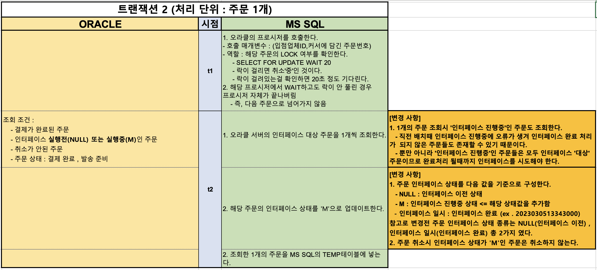

# 기존 인터페이스 과정

## 기존 인터페이스 과정

### 1. 트랜잭션 1 : 인터페이스 대상 주문을 조회하여 커서에 담는다.

<figure><figcaption></figcaption></figure>

#### 취소 중인 주문도 커서에 담길 수 있는 이유

1. 주문 취소시 해당 주문 Row에 SELECT FOR UPDATE를 걸어놓는다.
   * 다른 작업으로부터의 상태 변화를 방지함
2.  일반 SELECT 조회시에는 SELECT FOR UPDATE가 걸린 행도

    락이 걸리지 않는 덕분에 취소중인 주문도 커서에 담길 수 있다.

### 2. 트랜잭션 2 : 인터페이스 최종 대상 주문을 선별한다.

<figure><figcaption></figcaption></figure>

#### 취소 주문건에 대한 인터페이스 오류 발생

트랜잭션 2번의 t2 시점에서 다음과 같은 오류가 간간히 발생했다.

1. 인터페이스 최종 대상 주문을 1개 조회한다.
2.  가져온 주문번호를 temp 테이블에 넣는다.

    \=> ⭐️ **이 때 미리 가져온 주문번호를 temp 테이블에 넣는 순간 oracle 서버에서**

    **주문 취소가 발생한다.** ⭐️
3. **결국 주문이 취소됐으나 입점업체 DB 서버로 인터페이스가 되는 문제가 발생한다.**

### 3. 트랜잭션 3 : 주문 상태를 인터페이스 완료 상태로 변경한다.

<figure><figcaption></figcaption></figure>

